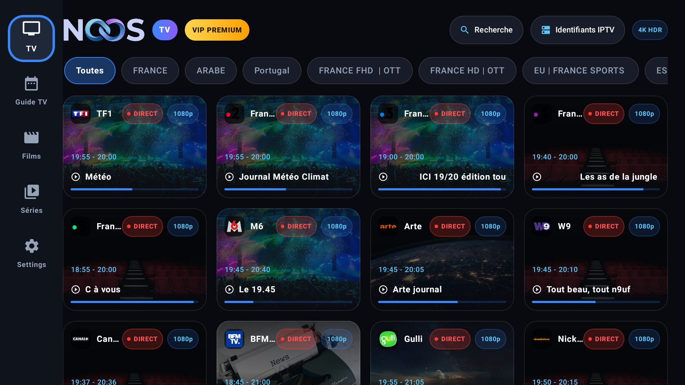
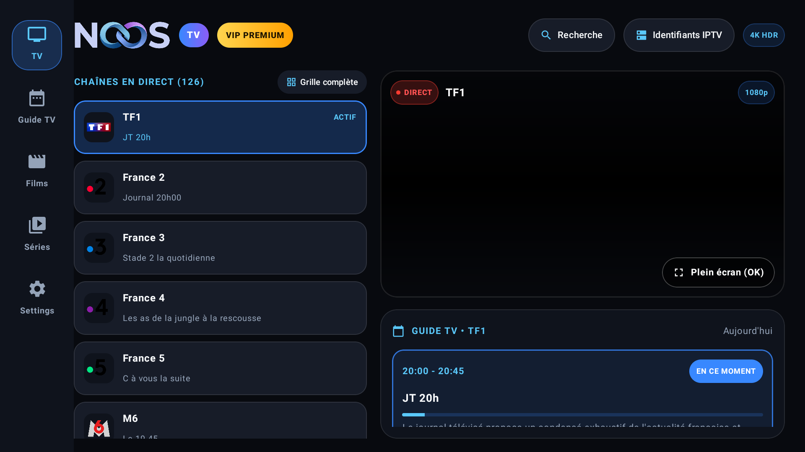
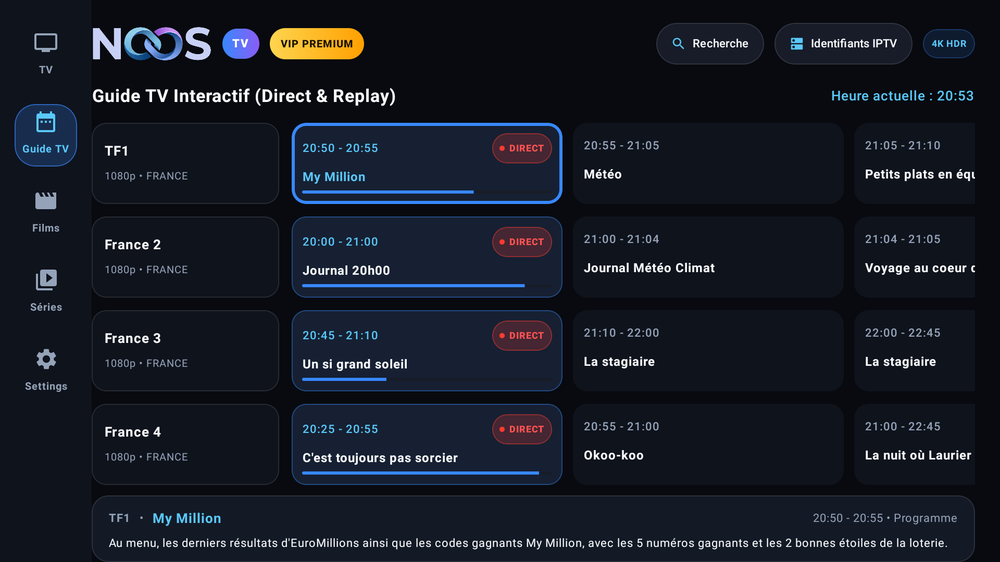
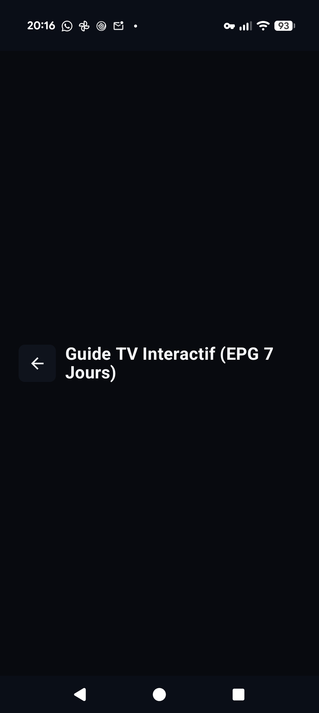
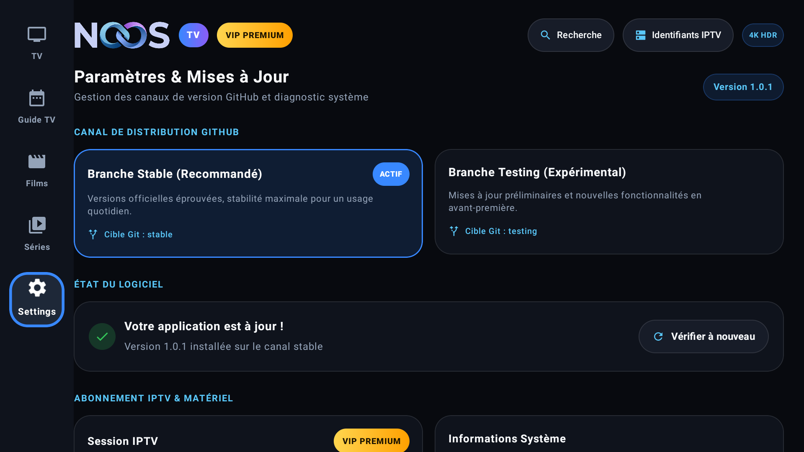
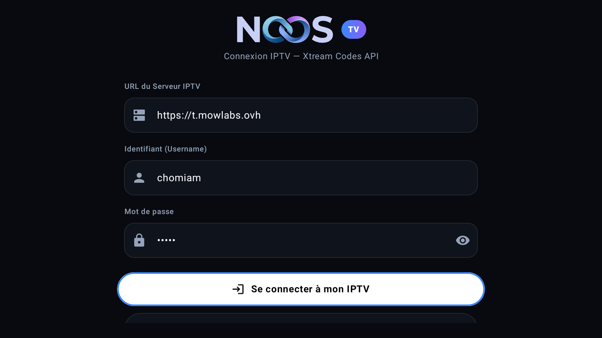

<div align="center">


# NoosTV

**Lecteur IPTV / OTT moderne, fluide et immersif pour Android TV & Android Mobile**

[](https://kotlinlang.org/)
[-3DDC84?logo=android&logoColor=white)](https://developer.android.com/)
[](https://developer.android.com/jetpack/compose)
[](https://developer.android.com/media/media3)
[](https://github.com/Chomiam/noostv/releases)

---

</div>

## 📌 Présentation

**NoosTV** est une application Android moderne et universelle conçue sur mesure pour offrir une expérience de streaming de premier plan sur **téléviseurs connectés, box Android TV (Nvidia Shield, Xiaomi Mi Box, Chromecast avec Google TV)** ainsi que sur **smartphones et tablettes Android**.

Développée intégralement en **Kotlin** et **Jetpack Compose for TV**, NoosTV intègre les standards visuels les plus modernes : thème sombre OLED épuré, angles arrondis prononcés (16–24dp), halos lumineux de sélection télécommande D-Pad, miniatures cinématographiques avec texte défilant automatique (*marquee*), fiches de détails riches pour les films et séries, zapping instantané, seekbar VOD interactive et mode de prévisualisation live split sur un quart d'écran.

---

## ✨ Fonctionnalités Clés

### 📺 1. TV en Direct avec Marquee & Backdrops Cinématographiques
- **Grille de chaînes interactive** à 4 colonnes avec logos et jaquettes de programme adaptées.
- **Défilement automatique du titre (*Marquee Text*)** : le nom du programme en cours défile en continu sur la carte pour une lisibilité parfaite même sur les titres longs.
- **Illustration contextuelle en arrière-plan** : affichage d'une image immersive adaptée au type d'émission (sport, info, cinéma, documentaires, animation).
- **Indicateurs en direct** : badge vibrant `DIRECT`, résolution (`1080p`, `4K UHD`, `HDR`) et jauge de progression horaire en temps réel.
- **Système de Favoris ⭐** : filtre dédié avec accès immédiat à vos chaînes préférées.

<div align="center">
  
  <p><em>Grille TV avec jaquettes thématiques, texte défilant et badges de direct</em></p>
</div>

---

### 🔲 2. Prévisualisation Live 1/4 d'Écran & Guide TV Dédié
- **Split View immersive** déclenchée au clic sur n'importe quelle chaîne :
  - **Colonne de gauche** : liste des chaînes pour zapping instantané avec repère de la chaîne active.
  - **Zone supérieure droite (1/4 d'écran)** : lecteur vidéo ExoPlayer diffusant le flux live en direct. Un clic sur `Plein écran (OK)` passe instantanément en mode plein écran sans coupure de flux.
  - **Zone inférieure droite** : **Guide TV de la chaîne sélectionnée** avec le programme actuel (« EN CE MOMENT »), la jauge d'avancement, le résumé complet et les émissions suivantes.
- **Bouton Favori ⭐** : marquage/démarquage rapide directement depuis la prévisualisation.
- **Navigation télécommande intuitive** : retour direct du plein écran vers la prévisualisation, puis de la prévisualisation vers la grille complète.

<div align="center">
  
  <p><em>Prévisualisation live 1/4 d'écran avec flux en direct et guide TV de la chaîne en dessous</em></p>
</div>

---

### 🎬 3. Fiches de Détails Cinématographiques VOD (Films & Séries)
- **Modale de Détails Films** :
  - Affiche grand format au ratio cinéma 2:3 non rogné.
  - Badges techniques complets : Définition (`4K UHD`, `1080p`), HDR (`HDR10`, `Dolby Vision`), Codec vidéo (`HEVC`, `AV1`) et audio (`AC3`, `AAC`).
  - Année de sortie, durée précise, note IMDb avec étoile dorée, tags de genres.
  - Synopsis complet, réalisateur et distribution.
  - Bouton `[▶ Lancer le film]` (focus automatique), bouton favoris et fermeture rapide par télécommande.
- **Modale de Détails Séries** :
  - Sélecteur horizontal de saisons (`Saison 1`, `Saison 2`, etc.).
  - Liste interactive des épisodes avec titre, durée, synopsis et icône de lecture directe.

<div align="center">
  
  &nbsp;
  
  <p><em>Fiches de détails interactives pour les Films et Séries TV sur Android TV</em></p>
</div>

---

### ⚡ 4. Lecteur Vidéo Avancé & Mini-HUD de Zapping
- **Mini-HUD de Zapping** : lors d'un changement de chaîne ou appui `HAUT` / `BAS`, un bandeau dynamique affiche la chaîne, le programme en cours, la barre d'avancement et le programme à suivre avant de s'estomper après 3,5s.
- **Zapping Numérique Direct** : saisie directe du numéro de chaîne via les touches numériques de la télécommande (0 à 9) avec pastille néon et temporisation d'1 seconde.
- **Ratio d'aspect vidéo réglable** : bascule à la volée entre `Ajusté (Letterbox 16:9)`, `Zoom (Plein écran rogné)` et `Étiré (Fill)`.
- **Seekbar VOD interactive** : timeline dynamique avec boutons saut arrière (-10s) et saut avant (+30s).
- **Gestion des Pistes Audio & Sous-titres** : sélection multilingue avec détection automatique.

<div align="center">
  
  <p><em>Mini-HUD de Zapping en surimpression avec progression du direct et prochain programme</em></p>
</div>

---

### 📅 5. Guide TV Interactif (EPG Complet avec Bandeau Synopsis)
- Vue tabulaire horizontale et chronologique pour visualiser les programmes par chaîne et par tranche horaire.
- **Bandeau dynamique de description** : affiche en bas d'écran le titre complet, la catégorie et le synopsis de l'émission ciblée par le curseur télécommande.
- Clic direct sur n'importe quelle émission pour lancer instantanément la chaîne en plein écran.

<div align="center">
  
  <p><em>Guide TV interactif avec mise en avant du programme ciblé et résumé complet</em></p>
</div>

---

### 📱 6. Application Android Mobile Dédiée
- **Interface adaptée pour smartphones et tablettes** avec barre de navigation inférieure moderne à 5 onglets :
  - **Direct** : liste des chaînes avec logos et programmes en cours.
  - **Films** : grille d'affiches 2:3 avec notes et années de sortie.
  - **Séries** : catalogue complet des séries avec filtres par catégorie.
  - **Guide TV** : grille horaire chronologique tactile.
  - **Paramètres** : gestion du compte, déconnexion et mises à jour OTA.

<div align="center">
  
  &nbsp;
  
  &nbsp;
  
  &nbsp;
  
  <p><em>Expérience mobile complète (testée et validée sur Google Pixel)</em></p>
</div>

---

### ⚙️ 7. Paramètres & Mises à Jour OTA GitHub (Stable / Testing)
- **Sélecteur de canal de mise à jour** : permet de basculer en un clic entre la branche **Stable** (version de production) et la branche **Testing** (nouvelles fonctionnalités en avant-première).
- **Vérification OTA intégrée** : interroge l'API GitHub Releases et affiche le numéro de version, les notes de version (*changelog*) et permet le téléchargement direct de l'APK.
- **Gestionnaire de compte** : statut de connexion, affichage de l'URL du serveur actif et déconnexion sécurisée.

<div align="center">
  
  <p><em>Menu Paramètres avec sélecteur de canal Stable / Testing et vérification OTA</em></p>
</div>

---

### 🔑 8. Connexion Xtream Codes & Mode Démo
- Écran de connexion ergonomique supportant la télécommande TV et le clavier virtuel :
  - **URL du serveur** (HTTP / HTTPS)
  - **Identifiant**
  - **Mot de passe**
- **Mode Démo intégré** : permet de tester immédiatement l'intégralité de l'application (flux live, 4K HDR, films, séries, EPG) sans identifiants externes.

<div align="center">
  
  <p><em>Écran d'authentification Xtream Codes</em></p>
</div>

---

## 🛠️ Stack Technique & Architecture

| Composant | Technologie | Description |
|---|---|---|
| **Langage** | [Kotlin 1.9](https://kotlinlang.org/) | 100% Kotlin moderne avec Coroutines & Flow |
| **Interface TV** | [Compose for TV 1.0](https://developer.android.com/jetpack/compose) | Composables TV optimisés pour le focus D-Pad |
| **Interface Mobile** | [Jetpack Compose Material 3](https://m3.material.io/) | Responsive design pour écrans tactiles mobiles |
| **Design System** | Midnight Dark OLED | Thème sombre OLED, palettes cyan & néon, arrondis 16–24dp |
| **Lecteur Vidéo** | [AndroidX Media3 ExoPlayer 1.2.1](https://developer.android.com/media/media3) | Support HLS, DASH, TS, MP4, décodage HEVC / AV1 / 4K / HDR |
| **Réseau & API** | [Ktor Client 2.3](https://ktor.io/) & [Kotlinx Serialization](https://github.com/Kotlin/kotlinx.serialization) | Client HTTP asynchrone pour l'API Xtream Codes |
| **Images** | [Coil 2.5](https://coil-kt.github.io/coil/) | Chargement d'images asynchrone avec cache disque/RAM |
| **Stockage** | [EncryptedSharedPreferences](https://developer.android.com/reference/androidx/security/crypto/EncryptedSharedPreferences) | Chiffrement matériel des identifiants et tokens de session |

---

## 📥 Téléchargement & Installation

### Option 1 — Téléchargement des APKs
Téléchargez directement le fichier `.apk` depuis la page des [Releases GitHub](https://github.com/Chomiam/noostv/releases) :
- **Canal Stable** : `noostv-v1.0.2.apk`
- **Canal Testing** : `noostv-v1.1.0-beta.2.apk`

### Option 2 — Installation via ADB
```bash
# Installation sur une TV ou Box connectée en réseau local
adb connect <IP_DE_VOTRE_BOX>:5555
adb install -r noostv-v1.0.2.apk

# Lancement direct
adb shell am start -n io.noostv/.MainActivity
```

---

## 🔨 Compilation depuis les Sources

### Prérequis
- **JDK 17** ou supérieur
- **Android SDK** (Build-Tools `34.0.0`, Platform `android-34`)
- **Gradle 8.2+** (inclus via Gradle Wrapper)

### Commandes
```bash
# Cloner le dépôt
git clone https://github.com/Chomiam/noostv.git
cd noostv

# Compiler l'APK Debug
./gradlew assembleDebug

# Compiler l'APK Release optimisé
./gradlew assembleRelease

# Déployer directement sur un appareil connecté
./gradlew installDebug
```

---

## 📄 Licence & Crédits

- Projet développé pour l'écosystème **Noos**.
- Tous droits réservés &copy; 2026 **NoosTV**.
