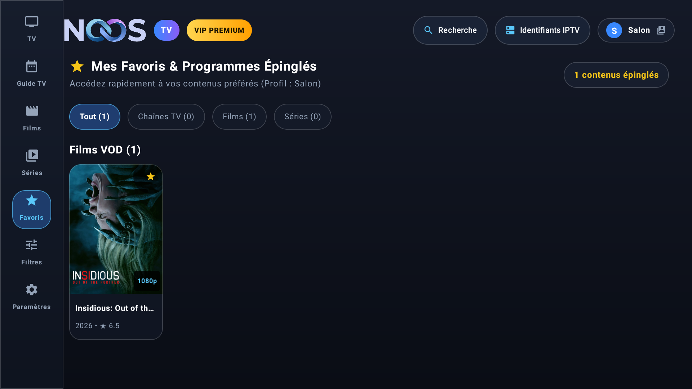

<div align="center">


# NoosTV

**Lecteur IPTV / OTT moderne, fluide et immersif pour Android TV & Android Mobile**

[](https://kotlinlang.org/)
[-3DDC84?logo=android&logoColor=white)](https://developer.android.com/)
[](https://developer.android.com/jetpack/compose)
[](https://developer.android.com/media/media3)
[](https://github.com/Chomiam/noostv/releases)

---

</div>

## 📌 Présentation

**NoosTV** est une application Android moderne et universelle conçue pour offrir une expérience de streaming fluide et immersive sur **téléviseurs connectés, box Android TV (Nvidia Shield, Xiaomi Mi Box, Chromecast avec Google TV)** ainsi que sur **smartphones et tablettes Android (Google Pixel, Samsung Galaxy, etc.)**.

Développée en **Kotlin** avec **Jetpack Compose for TV** et **Material 3**, NoosTV intègre les standards visuels et ergonomiques les plus soignés :
- **Design Glassy Frosted Blur** inspiré des interfaces Apple TV et Google TV (translucidité moderne, reflets lumineux et contraste dynamique),
- **Gestion Multi-Profils** sur un compte unique (avatars colorés, favoris et filtres isolés par utilisateur),
- **Onglet Favoris dédié** pour épingler chaînes en direct, films et séries préférés avec accès instantané,
- **Filtres de Catégories personnalisables** pour masquer/afficher à la volée les bouquets VOD dans la barre supérieure,
- Navigation D-Pad ultra-réactive avec halos lumineux néon,
- Fiches de détails cinématographiques riches avec métadonnées complètes pour les films et séries,
- Pagination intelligente pour explorer la totalité des catalogues de VOD volumineux (des dizaines de milliers de titres),
- Moteur de lecture vidéo robuste basé sur **Media3 ExoPlayer** avec accélération matérielle HEVC/H.264 et bascule automatique de conteneur (.mp4 / .mkv),
- Prévisualisation live sur 1/4 d'écran et zapping instantané,
- Sécurité renforcée avec chiffrement matériel des identifiants (AES-256-GCM Keystore) et masquage à l'écran,
- Système de mise à jour transparente **OTA (Over-The-Air)** directement depuis GitHub Releases.

---

## ✨ Fonctionnalités Clés

### 📺 1. TV en Direct avec Marquee & Prévisualisation 1/4 d'Écran
- **Grille de chaînes interactive** avec logos et jaquettes thématiques adaptées au programme en cours.
- **Texte défilant automatique (*Marquee*)** : le titre du programme défile en continu sur la carte pour une lisibilité parfaite.
- **Indicateurs de direct** : pastille `DIRECT`, résolution (`1080p`, `4K UHD`, `HDR`) et jauge de progression en temps réel.
- **Split-View 1/4 d'écran** : prévisualisation vidéo instantanée du flux sans quitter la liste des chaînes, avec guide EPG détaillé de l'émission actuelle et des suivantes. Passage en plein écran d'un seul clic.

<div align="center">
  
  &nbsp;
  
  <p><em>Grille TV avec texte défilant et mode prévisualisation 1/4 d'écran avec EPG</em></p>
</div>

---

### 📚 2. Catalogues VOD Films & Séries avec Pagination Intégrale
- **Navigation sans limite** : gestion paginée performante permettant de parcourir l'intégralité du catalogue VOD (plus de 39 000 films et 6 000 séries) avec une empreinte mémoire minimale et zéro latence.
- **Barre de pagination interactive** : boutons Précédent / Suivant et indicateur de position (`Page 1 / 5 (98 films)`) optimisés à la fois pour la télécommande D-Pad sur TV et pour le tactile sur mobile.
- **Filtres par catégories** : chips horizontaux défilants pour naviguer instantanément entre les genres et bouquets.

<div align="center">
  
  &nbsp;
  
  <p><em>Catalogues VOD Films et Séries sur Android TV avec affiches 2:3 et barre de pagination</em></p>
</div>

---

### 🎬 3. Fiches de Métadonnées Cinématographiques Complètes
- **Modale de Détails Films** :
  - Affiche haute résolution au ratio cinéma 2:3 et bannière d'arrière-plan (*backdrop*) immersive avec dégradé subtil.
  - Badges techniques complets : Définition (`1080p`, `4K UHD`), Codec vidéo (`HEVC`, `H264`), Codec audio (`AC3`, `AAC`), formats HDR.
  - Année de production, durée précise, note IMDb avec étoile dorée, genres.
  - Synopsis complet et bouton de lecture directe `[▶ Lancer le film]`.
- **Modale de Détails Séries** :
  - Sélecteur horizontal de saisons (`Saison 1`, `Saison 2`, etc.).
  - Liste interactive des épisodes avec numérotation, titre, miniature et bouton de lecture unitaire.
  - Bouton d'accès rapide au premier épisode (`▶ Regarder S1:E1`) avec repli automatique pour un lancement instantané sans attente réseau.
  - Gestion des favoris avec bouton dédié.

<div align="center">
  
  &nbsp;
  
  <p><em>Fiches de métadonnées enrichies pour les Films et Séries sur grand écran Android TV</em></p>
</div>

### 👤 4. Multi-Profils Utilisateur & Avatars Style Netflix / Prime
- **Bouton profil interactif dans l'en-tête** : pastille vitrée affichant le logo/avatar thématique et le nom du profil actif.
- **Gestion et personnalisation complète des profils** :
  - Renommage et édition en un clic avec suggestions rapides (*Salon, Famille, Enfants, Chambre, Invité, Cinéma*).
  - Sélecteur de logos / avatars style Netflix & Prime Video (10 icônes : Astronaute, Cinéphile, Gamer, Animaux, Flamme, Étoile, Enfant, Robot...).
  - Palette de couleurs vives (Bleu, Cyan, Violet, Émeraude, Ambre, Rose, Corail).
  - Bascule instantanée entre profils sans rechargement de compte ni déconnexion.
  - Suppression sécurisée des profils secondaires.
- **Isolation stricte des données** : chaque membre du foyer dispose de sa propre liste de favoris et de sa propre sélection de catégories VOD visibles.
- **Bouton Se déconnecter sécurisé** : remplace l'ancien libellé technique dans le bandeau supérieur avec dialogue de confirmation pour éviter les déconnexions accidentelles.
- **Esthétique Glassy Blur** : arrières-plans subtilement floutés, surfaces en verre dépoli, reflets lumineux et bordures translucides inspirés des dernières interfaces Apple TV et Google TV.

<div align="center">
  
  &nbsp;
  
  <p><em>Modale de profils et personnalisation avancée des avatars et couleurs sur Android TV</em></p>
</div>

---

### 🌟 5. Onglet Favoris & Programmes Épinglés
- **Centralisation des préférences** : regroupe dans un onglet dédié toutes vos chaînes de télévision en direct, films et séries favoris.
- **Navigation par onglets de filtrage** : *Tout*, *Chaînes TV*, *Films*, *Séries* avec compteurs d'éléments en temps réel.
- **Épinglage / Désépinglage en un clic** : depuis les fiches de détails ou directement depuis les cartes.
- **Zéro latence** : synchronisation instantanée avec le profil utilisateur actif.

<div align="center">
  
  <p><em>Écran des favoris avec filtres par type de média et accès immédiat aux programmes épinglés</em></p>
</div>

---

### 🎛️ 6. Filtres Avancés de Catégories VOD
- **Contrôle total du catalogue** : permet de masquer les bouquets ou langues non désirés parmi les centaines de catégories de films et séries.
- **Boutons d'action globale** : *Tout afficher* ou *Tout masquer* pour une configuration rapide.
- **Compteur dynamique** : affichage en direct du nombre de catégories actives (ex. `179 / 180 catégories visibles`).
- **Impact immédiat** : les catégories masquées disparaissent instantanément de la barre de défilement horizontal des onglets Films et Séries.

<div align="center">
  
  <p><em>Écran de filtrage des catégories VOD avec boutons d'activation et compteur dynamique</em></p>
</div>

---

### ⚡ 7. Moteur de Lecture Vidéo Avancé & Accélération Matérielle
- **Media3 ExoPlayer haute performance** :
  - Décodage matériel matériel optimisé pour flux **H.264, HEVC / H.265, AV1, VP9** jusqu'en 4K 60fps.
  - Décodeur de secours automatique (`enableDecoderFallback = true`) pour garantir la lecture même sur les flux aux profils vidéo exotiques.
  - Détection dynamique et repli automatique de conteneur : si un fichier VOD échoue en `.mp4`, le lecteur bascule automatiquement en flux `.mkv`.
  - En-têtes HTTP et User-Agent compatibles pour contourner les restrictions fournisseurs et timeouts de passerelle.
- **Contrôles OSD intuitifs** :
  - Seekbar précise avec boutons de saut temporel (-10s / +30s).
  - Bascule du ratio d'aspect vidéo : *Ajusté (16:9)*, *Zoom (Plein écran)*, *Étiré*.
  - Mini-HUD de zapping en surimpression avec progression horaire et titre du programme suivant.

<div align="center">
  
  &nbsp;
  
  <p><em>Lecteur vidéo avec décodage matériel et mini-HUD de zapping interactif</em></p>
</div>

---

### 📱 8. Expérience Dédiée Android Mobile
Une interface pensée pour les écrans tactiles verticaux et validée sur **Google Pixel 10 Pro** :
- **Barre de navigation inférieure à 5 onglets** : Direct, Films, Séries, Guide TV, Paramètres.
- **Fiches de détails VOD en bottom sheet tactile** avec backdrops dynamiques, badges techniques et lecture en 1 geste.
- **Lecteur vidéo mobile plein écran** avec commandes tactiles transparentes et bascule portrait/paysage.

<div align="center">
  
  &nbsp;
  
  &nbsp;
  
  &nbsp;
  
  &nbsp;
  
  <p><em>Interface mobile Android moderne : chaînes en direct, catalogues paginés et fiches de détails</em></p>
</div>

---

### 📅 9. Guide TV Électronique Interactif (EPG)
- Grille tabulaire chronologique des programmes par tranche horaire et par chaîne.
- **Bandeau de synopsis dynamique** : affiche en temps réel la description, le genre et les horaires exacts du programme sélectionné.
- Clic direct sur n'importe quelle émission pour démarrer immédiatement la chaîne associée.

<div align="center">
  
  <p><em>Guide TV interactif avec bandeau synopsis dynamique</em></p>
</div>

---

### 🔄 10. Mises à Jour OTA Automatiques (Stable & Testing)
- **Gestionnaire OTA intégré** interrogeant directement GitHub Releases.
- **Sélecteur de canal** : basculez d'un clic entre la branche **Stable** (production certifiée) et la branche **Testing** (nouvelles fonctionnalités et correctifs en avant-première).
- Détection automatique des nouvelles versions, affichage des notes de mise à jour (*changelog*) et installation transparente de l'APK.

<div align="center">
  
  <p><em>Menu Paramètres avec sélecteur de canal OTA et vérification des mises à jour</em></p>
</div>

---

## 🛠️ Stack Technique

| Composant | Technologie | Rôle |
|---|---|---|
| **Langage** | [Kotlin 1.9.22](https://kotlinlang.org/) | Coroutines, StateFlow, code partagé TV / Mobile |
| **Interface TV** | [Compose for TV 1.0](https://developer.android.com/jetpack/compose) | Composables TV optimisés pour la télécommande D-Pad |
| **Interface Mobile** | [Jetpack Compose Material 3](https://m3.material.io/) | Composables tactiles pour smartphones et tablettes |
| **Design System** | Midnight Dark OLED | Palette sombre, accents cyan `#00E5FF` et ambre `#FFB300` |
| **Lecteur Vidéo** | [AndroidX Media3 ExoPlayer 1.2.1](https://developer.android.com/media/media3) | Décodage matériel HEVC / H.264 / AV1, HLS, DASH, TS, MP4, MKV |
| **Réseau & API** | [OkHttp 4.12](https://square.github.io/okhttp/) & [Gson](https://github.com/google/gson) | Client Xtream Codes résilient avec timeouts optimisés et extraction zéro-latence |
| **Images** | [Coil 2.5](https://coil-kt.github.io/coil/) | Chargement asynchrone des posters, bannières et logos avec mise en cache mémoire/disque |
| **Sécurité** | [EncryptedSharedPreferences](https://developer.android.com/reference/androidx/security/crypto/EncryptedSharedPreferences) | Stockage sécurisé des identifiants et tokens de session |

---

## 📥 Téléchargement & Installation

### Option 1 — Téléchargement des APKs
Rendez-vous sur la page des [Releases GitHub](https://github.com/Chomiam/noostv/releases) pour télécharger l'APK correspondant à votre usage :
- **Canal Stable** : `noostv-v1.1.0.apk` (Recommandé pour un usage quotidien)
- **Canal Testing** : `noostv-v1.1.0-beta.3.apk` (Dernières nouveautés)

### Option 2 — Déploiement via ADB
```bash
# 1. Connexion à votre appareil (Android TV ou smartphone en débogage sans fil)
adb connect <ADRESSE_IP>:5555

# 2. Installation de l'APK
adb install -r noostv-v1.1.0.apk

# 3. Lancement de l'application
adb shell am start -n io.noostv/.MainActivity
```

---

## 🔨 Compilation depuis les Sources

### Prérequis
- **JDK 17** configuré (`JAVA_HOME`)
- **Android SDK** avec Build-Tools `34.0.0` et Platform `android-34`
- **Gradle 8.2+** (géré via `./gradlew`)

### Commandes
```bash
# Cloner le dépôt
git clone https://github.com/Chomiam/noostv.git
cd noostv

# Compiler l'APK de débogage
./gradlew assembleDebug

# Compiler l'APK Release optimisé
./gradlew assembleRelease

# Déployer directement sur un appareil ADB connecté
./gradlew installDebug
```

---

## 📄 Licence

Projet développé pour l'écosystème **Noos**.  
Tous droits réservés &copy; 2026 **NoosTV**.
