<div align="center">


# NoosTV

**Lecteur IPTV / OTT moderne, fluide et immersif pour Android TV & Android Mobile**

[](https://kotlinlang.org/)
[-3DDC84?logo=android&logoColor=white)](https://developer.android.com/)
[](https://developer.android.com/jetpack/compose)
[](https://developer.android.com/media/media3)
[](https://github.com/Chomiam/noostv/releases)

---

</div>

## 📌 Présentation

**NoosTV** est une application Android moderne et universelle conçue pour offrir une expérience de streaming fluide et immersive sur **téléviseurs connectés, box Android TV (Nvidia Shield, Xiaomi Mi Box, Chromecast avec Google TV)** ainsi que sur **smartphones et tablettes Android (Google Pixel, Samsung Galaxy, etc.)**.

Développée en **Kotlin** avec **Jetpack Compose for TV** et **Material 3**, NoosTV intègre les standards visuels et ergonomiques les plus soignés :
- **Arrière-plan macOS Dark Glassmorphic** : dégradés de couleurs sombres et flou de profondeur (*frost blur*) inspirés de la transparence feutrée des fenêtres Apple sur Mac,
- **Écran de Chargement Intégral Stylisé** : affichage immersif plein écran avec barre de progression en dégradé cyan/violet et statut d'indexation temps réel,
- **Dock Latéral Flottant à 6 Onglets Épurés** : navigation TV sans accroc (*Direct TV, Films, Séries, Favoris, Filtres, Paramètres*), avec isolation stricte du focus D-pad sans déplacement intempestif sur la grille,
- **Filtres de Catégories & Focus Haute Visibilité (Style Apple)** : sélecteur par type (*Chaînes, Films, Séries*), mise en avant éclatante en pilule blanche sous le curseur, et boutons d'action rapide *Tout afficher* / *Tout masquer*,
- **Sons de Navigation d'Interface (Style Apple TV)** : retours acoustiques feutrés (ticks de navigation, pops de validation, descente au retour) joués à latence zéro avec limitation de cadence (*rate limiting* anti-saturation),
- **Split-View Direct TV 1/4 d'Écran avec Guide TV Intégré** : liste des chaînes à gauche avec zapping instantané, prévisualisation vidéo allégée et Guide TV chronologique complet en dessous à droite,
- **Lecteur Vidéo Ergonomique pour Télécommande D-Pad** : réglages avancés (Infos débit/codec, Vitesse, Qualité, Audio/Subs, Format) regroupés dans la barre inférieure pour un accès en un clic depuis Play/Pause,
- **Détection Vidéo Intelligente (CinemaScope & Multi-Flux)** : reconnaissance fidèle des flux 1080p et 4K même pour les formats cinéma larges (1920×800) sans fausse classification en 720p,
- **Écran de Connexion Rapide Multi-Comptes** : vue partagée avec historique des identifiants chiffrés localement via **AES-256-GCM Keystore matériel**,
- **Gestion Multi-Profils** sur un compte unique (avatars colorés style Netflix/Prime, favoris et filtres isolés par utilisateur),
- **Support International 7 Langues** : Français, Anglais, Espagnol, Allemand, Italien, Arabe et Portugais,
- **Système de Mise à Jour OTA Transparent** directement depuis GitHub Releases avec sélecteur de canal Stable et Testing.

---

## ✨ Fonctionnalités Clés

### ⚡ 1. Écran de Chargement Intégral & Ambiance macOS Dark Glass
- **Écran de chargement immersif plein écran** : affiché pendant le démarrage et l'indexation du catalogue IPTV pour une mise en route soignée et élégante.
- **Barre de progression stylisée** : jauge animée en pilule glossy avec dégradé lumineux (cyan vers violet/magenta), pourcentage temps réel et capsule d'information.
- **Arrière-plan macOS Dark Glassmorphic** : dégradés sombres nuancés et flou artistique permanent créant une profondeur visuelle haut de gamme adaptée aux téléviseurs OLED et 4K.

<div align="center">
  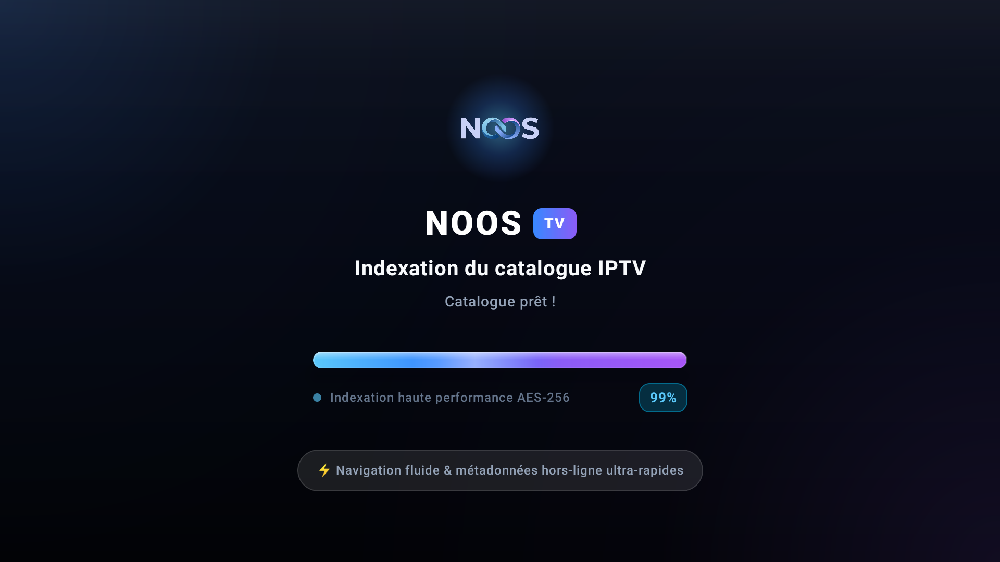
  <p><em>Écran de chargement plein écran avec jauge stylisée et arrière-plan dégradé sombre façon macOS</em></p>
</div>

---

### 📺 2. TV en Direct avec Split-View 1/4 d'Écran & Guide TV Intégré
- **Disposition optimisée TV & Paysage** :
  - **Colonne gauche** : liste interactive des chaînes avec pastilles dynamiques et recherche rapide.
  - **Colonne droite** : lecteur de prévisualisation 1/4 d'écran avec zapping fluide, et **Guide TV chronologique** de la chaîne active juste en dessous.
- **Guide TV intégré sans dispersion** : le guide des programmes est désormais directement intégré dans l'onglet Direct TV, supprimant tout onglet ou écran séparé superflu.
- **Décodage allégé en prévisualisation** : limitation automatique à 720p/2.5 Mbps pendant la navigation dans la liste pour supprimer toute saccade, puis déverrouillage intégral lors du passage en plein écran.
- **Accès plein écran instantané** : validation sur le lecteur ou sur le bouton interactif `[Plein écran (OK)]`.

<div align="center">
  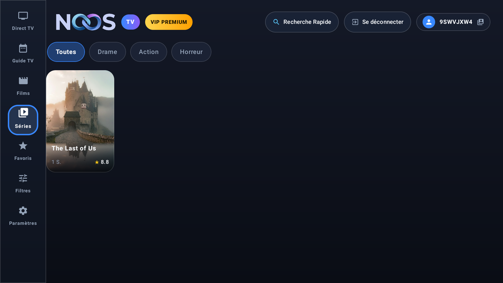
  <p><em>Vue divisée Direct TV : liste des chaînes à gauche, prévisualisation vidéo et Guide TV à droite</em></p>
</div>

---

### 🔑 3. Connexion Rapide Multi-Comptes & Chiffrement Matériel AES-256
- **Écran de connexion divisé (Split-Screen)** : formulaire d'authentification standard à gauche et liste des identifiants enregistrés à droite pour une reconnexion immédiate en un clic.
- **Sécurité et confidentialité absolues** :
  - Stockage exclusivement local, aucun serveur tiers.
  - Chiffrement matériel **AES-256-GCM** via l'Android Keystore (`MasterKey`).
  - Possibilité de supprimer individuellement chaque compte de l'historique d'un clic sur l'icône corbeille.

<div align="center">
  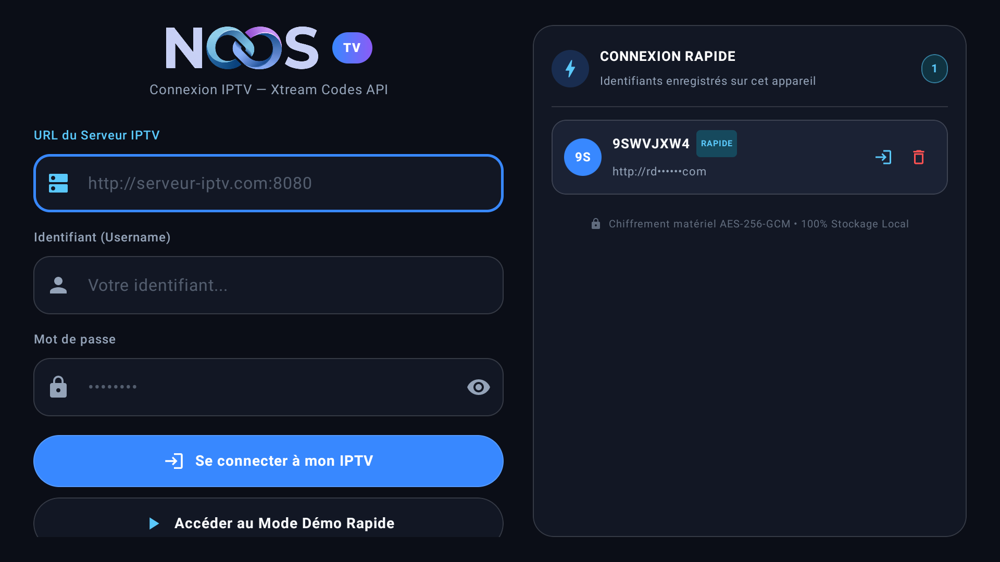
  <p><em>Écran de connexion avec historique des comptes chiffrés pour une connexion instantanée</em></p>
</div>

---

### 🎛️ 4. Filtres de Catégories & Focus D-Pad Haute Visibilité
- **Personnalisation fine du catalogue** : masquez ou affichez instantanément les catégories de votre fournisseur IPTV, avec persistance automatique par profil utilisateur.
- **Sélecteur de type en pilules modernes** : basculez aisément entre *Chaînes TV*, *Catégories Films* et *Catégories Séries*.
- **Curseur Haute Visibilité (Style Apple)** : l'onglet sélectionné sous le curseur s'illumine en **pilule blanche brillante éclatante** avec texte et icône noir profond, halo cyan et animation d'échelle (`scale 1.08x`), éliminant toute ambiguïté sur grand écran.
- **Navigation 2D bidirectionnelle fluide** :
  - **Droite** : passage immédiat depuis le dock latéral vers l'onglet actif.
  - **Bas** : saut direct vers la grille de catégories à 3 colonnes.
  - **Haut** : retour instantané vers les onglets de filtrage.
  - **Gauche / Retour** : retour immédiat vers le dock latéral sans blocage.
- **Actions globales en 1 clic** : boutons interactifs *Tout afficher* et *Tout masquer* avec retour visuel immédiat.

<div align="center">
  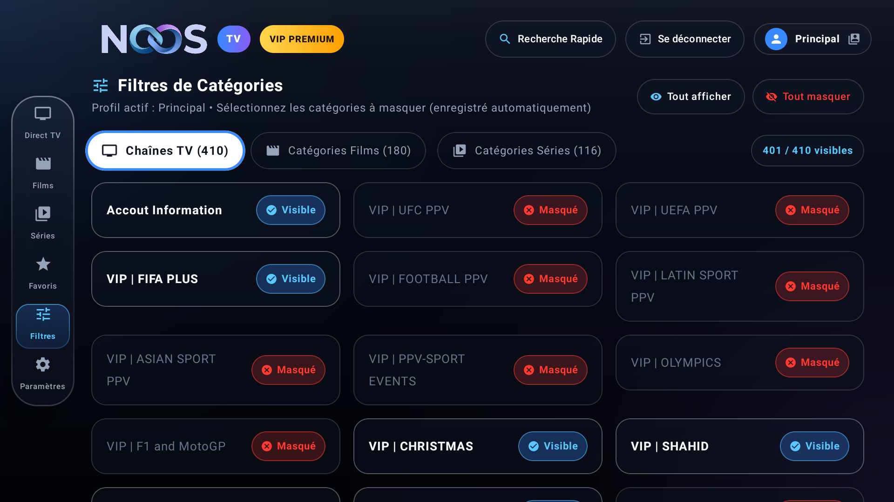
  &nbsp;
  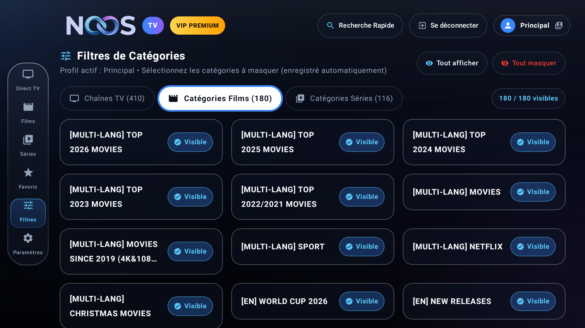
  <p><em>Gestion des filtres de catégories avec focus haute visibilité style Apple et navigation D-pad fluide</em></p>
</div>

---

### 📚 5. Catalogues VOD Films & Séries avec Pagination Intégrale
- **Navigation sans limite** : gestion paginée performante permettant de parcourir l'intégralité du catalogue VOD (plus de 39 000 films et 6 000 séries) avec une empreinte mémoire minimale et zéro latence.
- **Dock latéral fixe sans saut de curseur** : le curseur ne bascule plus accidentellement vers la grille de films lors du défilement vertical dans la barre latérale.
- **Barre de pagination interactive** : boutons Précédent / Suivant et indicateur de position (`Page 1 / 18 (642 films)`) optimisés pour la télécommande D-Pad sur TV et pour le tactile sur mobile.
- **Filtres par genres** : chips horizontaux défilants pour naviguer instantanément entre les bouquets et catégories.

<div align="center">
  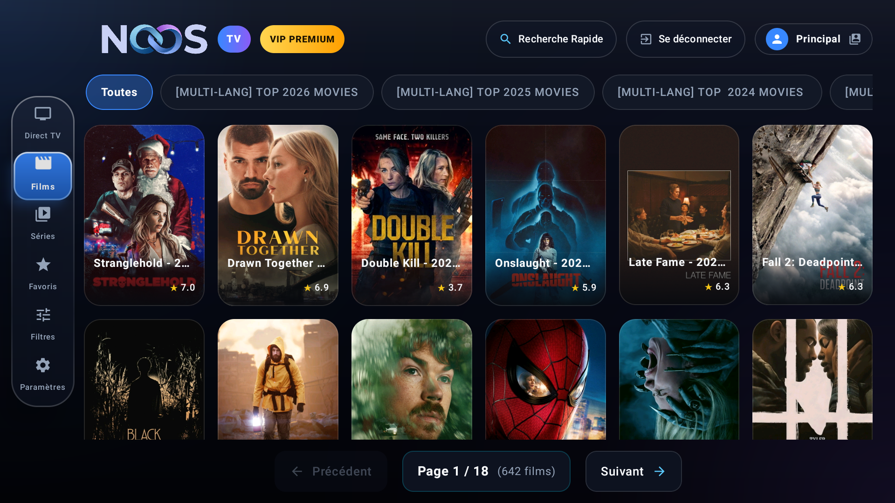
  &nbsp;
  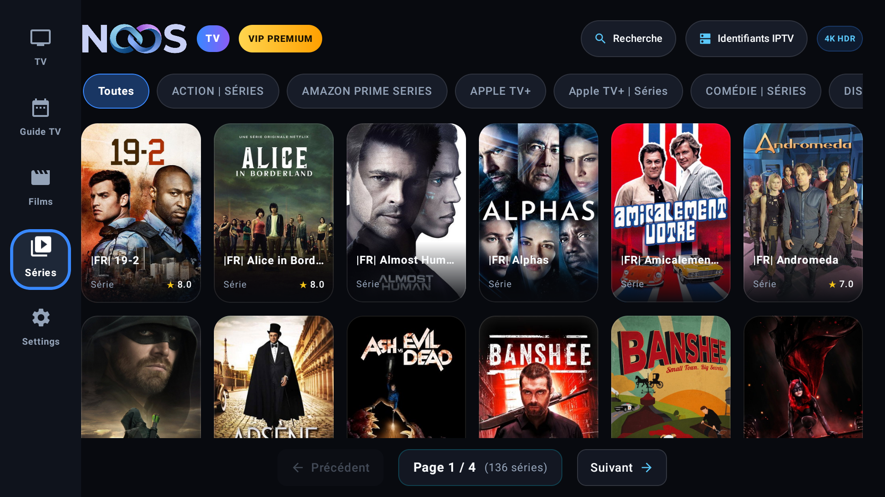
  <p><em>Catalogues VOD Films et Séries sur Android TV avec affiches 2:3, dock latéral épuré et barre de pagination</em></p>
</div>

---

### ⚡ 6. Lecteur Vidéo Ergonomique & Contrôles Inférieurs
- **Accès D-Pad simplifié** : tous les boutons d'options sont disposés dans la barre inférieure, directement sous les boutons de lecture (Play/Pause, Précédent, Suivant). Une seule pression vers le Bas sur la télécommande sélectionne la rangée de réglages.
- **Options disponibles en un clic** :
  - **Infos** : débit en direct, codec vidéo et audio, nombre de canaux, framerate et santé du tampon de lecture (*buffer health*).
  - **Vitesse de lecture** : réglable de 0.5x à 2.0x avec synchronisation audio instantanée.
  - **Qualité vidéo** : sélection manuelle du flux (4K, 1080p, 720p, SD) ou bascule en Automatique adaptatif.
  - **Audio & Sous-titres** : sélecteur de pistes multilingues et sous-titres avec détection des formats (AC3, AAC, EAC3, DTS).
  - **Format d'image** : bascule à la volée entre *Format Ajusté*, *Format 16:9 (Zoom)* et *Format Étiré*.
- **Détection de résolution précise** : compatibilité parfaite avec les films 1080p CinemaScope (1920×800) sans fausse classification.

<div align="center">
  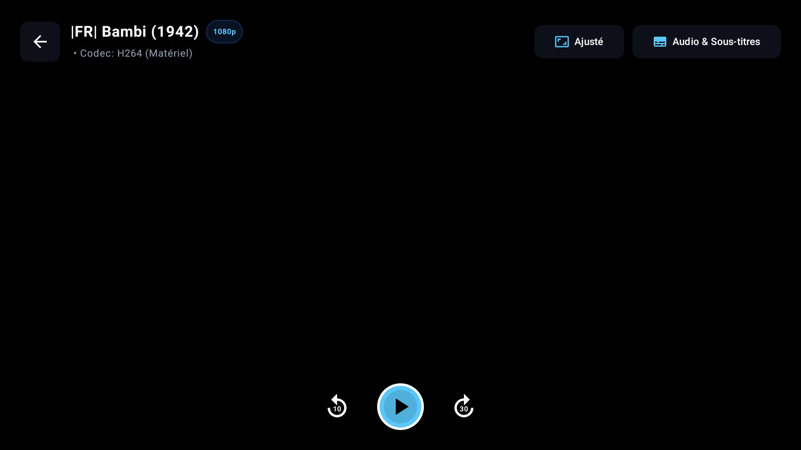
  &nbsp;
  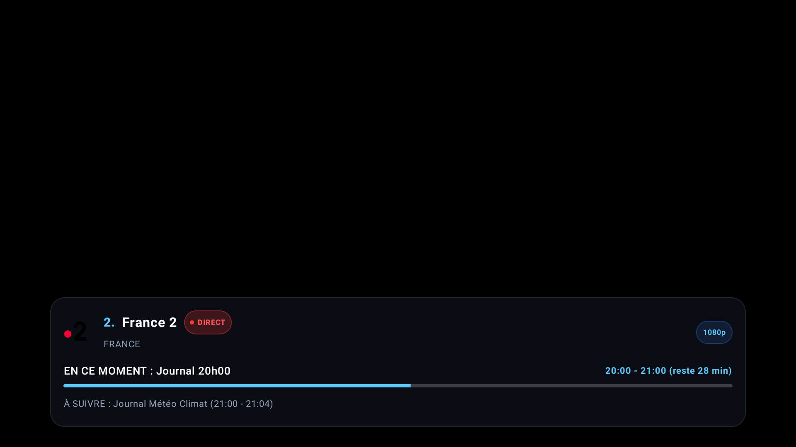
  <p><em>Lecteur vidéo avec contrôles dans la barre inférieure et HUD de zapping interactif</em></p>
</div>

---

### 🎬 7. Fiches de Métadonnées Cinématographiques Riches
- **Modale de Détails Films** : affiche haute résolution, backdrop cinéma, badges techniques (Définition, Codec vidéo/audio, HDR), durée, note IMDb, synopsis et bouton `[▶ Lancer le film]`.
- **Modale de Détails Séries** : sélecteur horizontal de saisons, liste des épisodes avec titres, résumés et bouton d'accès direct `[▶ Regarder S1:E1]`.
- **Navigation D-Pad fluide** : la croix de fermeture est directement accessible via la touche Haut de la télécommande depuis les épisodes ou les boutons d'action.

<div align="center">
  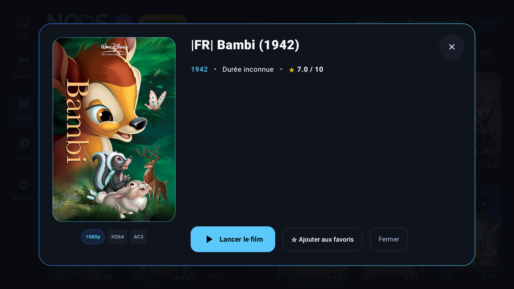
  &nbsp;
  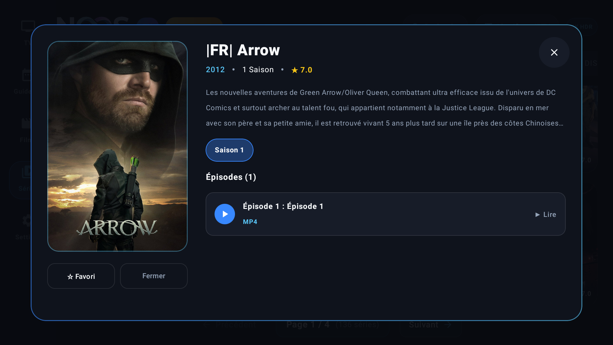
  <p><em>Fiches de métadonnées enrichies pour les Films et Séries sur grand écran Android TV</em></p>
</div>

---

### 👤 8. Multi-Profils Utilisateur & Avatars Style Netflix / Prime
- **Bouton profil interactif dans l'en-tête** : pastille vitrée affichant l'avatar thématique et le nom du profil actif.
- **Gestion et personnalisation complète des profils** :
  - Renommage et édition en un clic avec suggestions rapides (*Salon, Famille, Enfants, Chambre, Invité, Cinéma*).
  - Sélecteur de logos / avatars style Netflix & Prime Video (10 icônes : Astronaute, Cinéphile, Gamer, Animaux, Flamme, Étoile, Enfant, Robot...).
  - Palette de couleurs vives (Bleu, Cyan, Violet, Émeraude, Ambre, Rose, Corail).
  - Bascule instantanée entre profils sans rechargement de compte ni déconnexion.
  - Suppression sécurisée des profils secondaires.
- **Isolation stricte des données** : chaque membre du foyer dispose de sa propre liste de favoris et de ses propres catégories masquées.

<div align="center">
  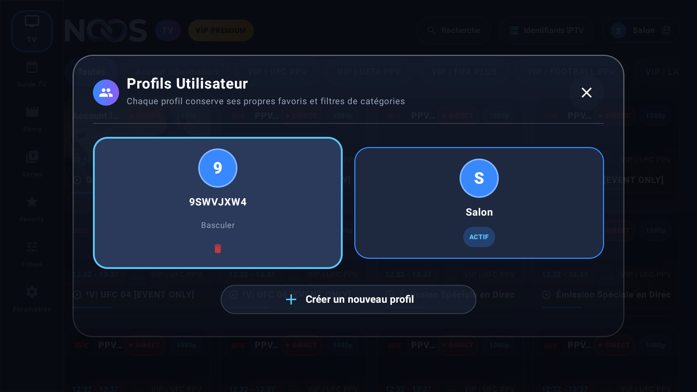
  &nbsp;
  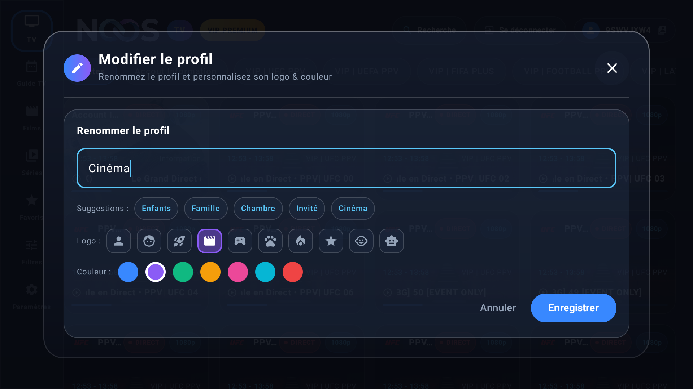
  <p><em>Modale de profils et personnalisation avancée des avatars et couleurs sur Android TV</em></p>
</div>

---

### 🔊 9. Sons de Navigation d'Interface (Style Apple TV)
- **Expérience sonore raffinée** : retours acoustiques subtils et discrets reproduisant fidèlement l'élégance de tvOS :
  - **Déplacement de curseur (D-Pad)** : *tick* organique court (~24 ms) feutré façon marimba.
  - **Validation (Bouton OK)** : *pop / tap* chaleureux (~42 ms) lors d'une sélection.
  - **Retour (Bouton Back)** : descente douce et discrète (~55 ms).
  - **Bordure de liste** : butée feutrée (*thud*).
- **Zéro latence** : flux audio PCM 44.1 kHz 16-bit synthétisés et préchargés via `SoundPool`.
- **Limiteur de cadence (*Rate Limiting*)** à 45 ms évitant toute saturation lors du défilement continu.
- **Interrupteur dédié** dans les Paramètres sous la section **Expérience & Audio** pour activer ou désactiver les sons.

---

### 🌍 10. Support International 7 Langues & Paramètres Complets
- **Sélecteur de langue d'interface avec drapeaux** : Français 🇫🇷, English 🇬🇧, Español 🇪🇸, Deutsch 🇩🇪, Italiano 🇮🇹, العربية 🇸🇦, Português 🇵🇹.
- **Mises à jour transparentes OTA** : vérification et téléchargement direct des nouvelles versions depuis GitHub Releases (canaux Stable et Testing).
- **Diagnostics système en direct** : informations détaillées sur l'appareil, mémoire cache Coil et statut de connexion.

<div align="center">
  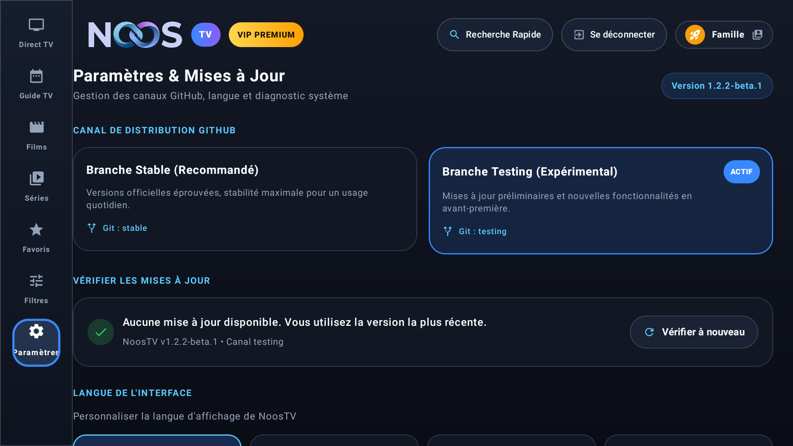
  <p><em>Menu Paramètres avec sélecteur de langue, contrôle des sons d'interface et mises à jour OTA</em></p>
</div>

---

### 📱 11. Expérience Dédiée Android Mobile
Une interface pensée pour les écrans tactiles verticaux et validée sur **Google Pixel 10 Pro** :
- **Barre de navigation inférieure à 5 onglets** : Direct, Films, Séries, Favoris, Paramètres.
- **Fiches de détails VOD en bottom sheet tactile** avec backdrops dynamiques, badges techniques et lecture en 1 geste.
- **Lecteur vidéo mobile plein écran** avec commandes tactiles transparentes et bascule portrait/paysage.

<div align="center">
  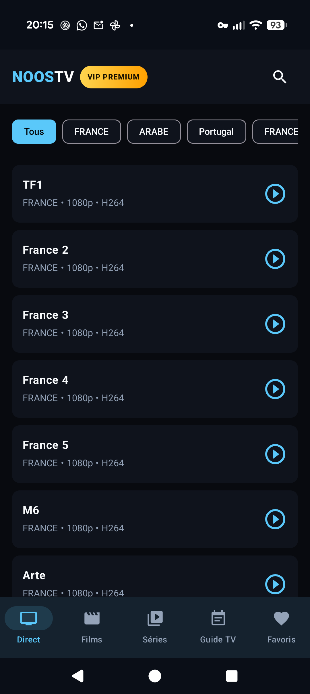
  &nbsp;
  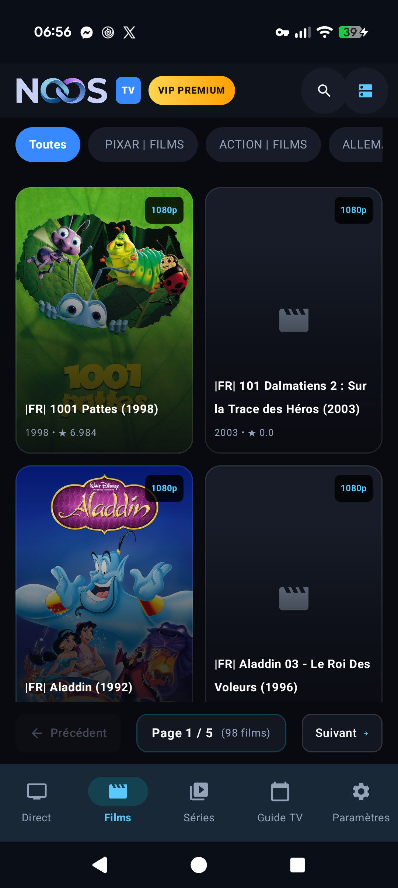
  &nbsp;
  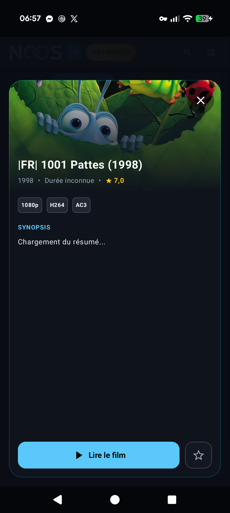
  &nbsp;
  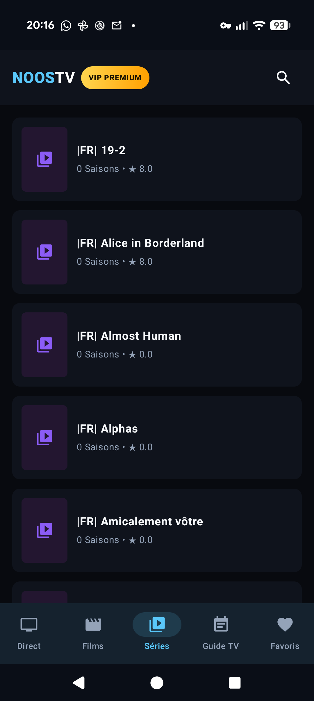
  &nbsp;
  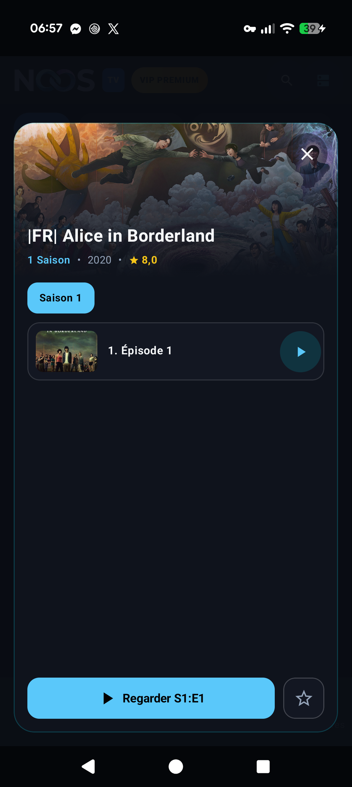
  <p><em>Interface mobile Android moderne : chaînes en direct, catalogues paginés et fiches de détails</em></p>
</div>

---

## 🛠️ Stack Technique

| Composant | Technologie | Rôle |
|---|---|---|
| **Langage** | [Kotlin 1.9.22](https://kotlinlang.org/) | Coroutines, StateFlow, code unifié TV / Mobile |
| **Interface TV** | [Compose for TV 1.0](https://developer.android.com/jetpack/compose) | Composables TV optimisés pour la télécommande D-Pad |
| **Interface Mobile** | [Jetpack Compose Material 3](https://m3.material.io/) | Composables tactiles pour smartphones et tablettes |
| **Design System** | Apple Frosted Glass & Dark OLED | Palette sombre dégradée macOS, accents cyan `#00E5FF` et or `#FFB300` |
| **Moteur Audio UI** | [Android SoundPool](https://developer.android.com/reference/android/media/SoundPool) | Effets sonores de navigation style Apple TV à latence zéro |
| **Lecteur Vidéo** | [AndroidX Media3 ExoPlayer 1.2.1](https://developer.android.com/media/media3) | Décodage matériel HEVC / H.264 / AV1, HLS, DASH, TS, MP4, MKV |
| **Réseau & API** | [OkHttp 4.12](https://square.github.io/okhttp/) & [Gson](https://github.com/google/gson) | Client Xtream Codes résilient avec timeouts optimisés et extraction zéro-latence |
| **Images** | [Coil 2.6](https://coil-kt.github.io/coil/) | Chargement asynchrone des posters, bannières et logos avec cache mémoire 100 Mo matériel |
| **Sécurité** | [EncryptedSharedPreferences & Keystore](https://developer.android.com/reference/androidx/security/crypto/EncryptedSharedPreferences) | Chiffrement matériel AES-256-GCM des identifiants et comptes multiples |

---

## 📥 Téléchargement & Installation

### Option 1 — Téléchargement des APKs
Rendez-vous sur la page des [Releases GitHub](https://github.com/Chomiam/noostv/releases) pour télécharger l'APK correspondant à votre usage :
- **Canal Stable** : `app-release.apk` (Version Finale v1.2.8 recommandée pour un usage quotidien)
- **Canal Testing** : Versions beta / pré-releases pour tester les dernières nouveautés

### Option 2 — Déploiement via ADB
```bash
# 1. Connexion à votre appareil (Android TV ou smartphone en débogage sans fil)
adb connect <ADRESSE_IP>:5555

# 2. Installation de l'APK
adb install -r app-release.apk

# 3. Lancement de l'application
adb shell am start -n io.noostv/.MainActivity
```

---

## 🔨 Compilation depuis les Sources

### Prérequis
- **JDK 21 LTS** configuré (`JAVA_HOME`)
- **Android SDK** avec Build-Tools `34.0.0` et Platform `android-34`
- **Gradle 8.2+** (géré via `./gradlew`)

### Commandes
```bash
# Cloner le dépôt
git clone https://github.com/Chomiam/noostv.git
cd noostv

# Compiler l'APK de débogage
./gradlew assembleDebug

# Compiler l'APK Release optimisé
./gradlew assembleRelease

# Déployer directement sur un appareil ADB connecté
./gradlew installDebug
```

---

## 📄 Licence

Projet développé pour l'écosystème **Noos**.  
Tous droits réservés &copy; 2026 **NoosTV**.
